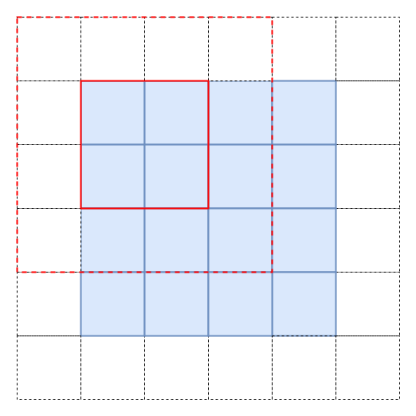

[](https://travis-ci.org/Nikolay-Lysenko/gpn)

# GPN

### Brief Overview

This repository relates to a research idea about stabilizing of generative neural networks training.

Suggested approach is called Generative Predictive Networks (GPN). It is a combination of two components:
* Similarly to GANs, there are discriminator and generator;
* Unlikely to GANs, they are not trained simultaneously — discriminator is trained in a predictive learning setup and then generator is trained.

To the best of the author's knowledge, this approach is novel. Any references to existing literature about the topic are highly appreciated.

### The Approach



Above figure can be used for grasping internal terminology of the project.

To start with, original dataset consists of images of equal size. Suppose that such an image is shown in light blue in the above figure.

However, positive examples for discriminator are not taken from the initial dataset. They are fragments sampled from original images. Each such fragment consists of two parts:
* The first one is called internal part, it is a square of size `internal_size * internal_size`, and all its pixels are also pixels of the corresponding original image. Example of internal part is marked with a solid red line in the figure.
* The second one is a frame around internal part. Some of its pixels can be pixels from the original image, and some of its pixels can be pixels from zero padding around the image. Outer border of the frame is represented as dotted red line in the figure. Zero padding is represented as pixels with dotted borders. As for parameters, frame is characterized by the one named `frame_size` (it is set to 1 in the figure).

Thus, discriminator is trained on images of size `fragment_size`, where `fragment_size = internal_size + 2 * frame_size`. Positive examples are sampled from the original dataset. Negative examples have real frames, but altered internal parts. There are several ways to modify internal part:
* To blur it;
* To replace it with noise;
* To replace it with internal part of another fragment.

Real frame is a context of central part, and so the setup of discriminator problem can be likened to predictive learning setup.

Now, go to generator. It is trained to turn random noise into full-size images (not fragments). Generator loss is based on discriminator performance on fragments sampled from generated images. The more discriminator is confident in fake origination of such fragments, the higher the loss is.

### Usage

To use the Python package from this repository, build it from sources:
```
cd your/path
git clone https://github.com/Nikolay-Lysenko/gpn
cd gpn
pip install -r requirements.txt
pip install -e .
```

To study any settings, go to `gpn/config.yml`.

The recommended way to use the package is to execute it as a script. To see valid options, run:
```
python -m gpn -h
```
